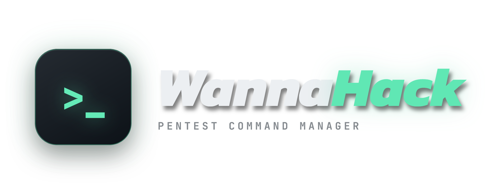
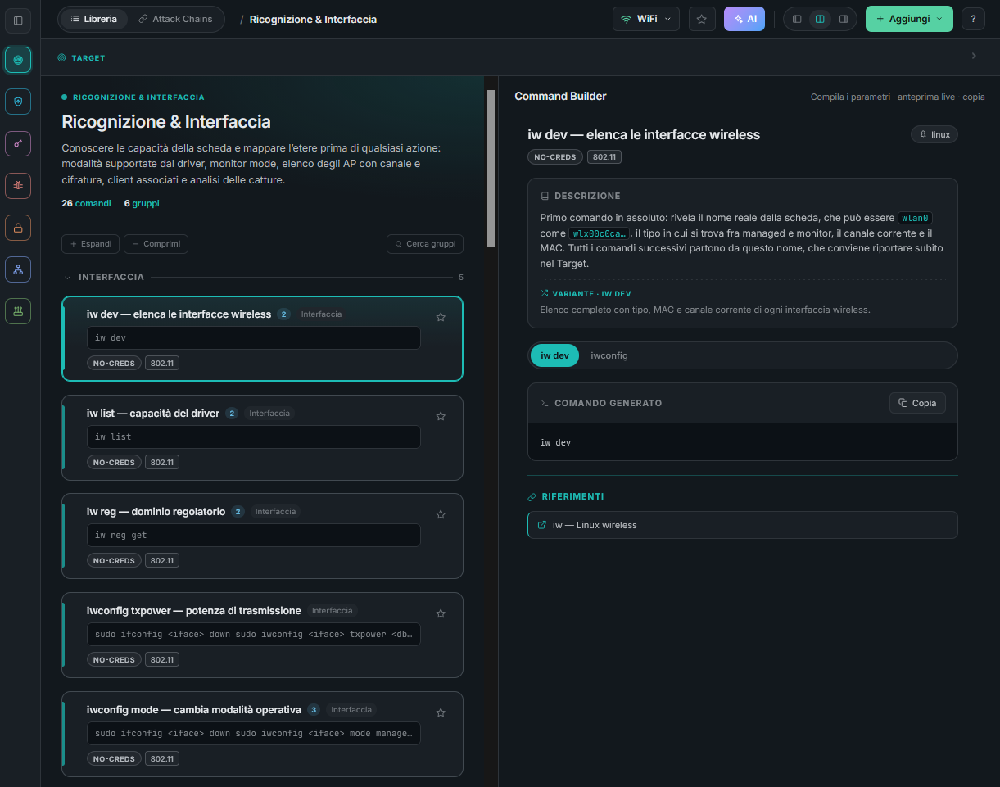
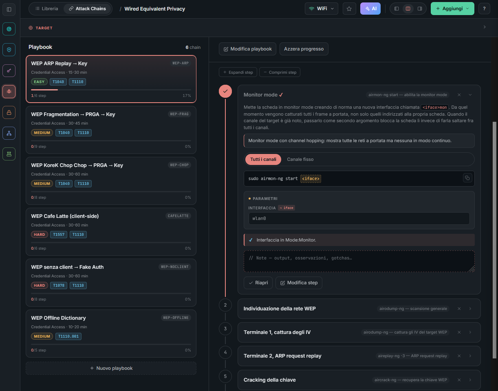

<p align="center">
  
</p>

<p align="center">
  Command reference and attack playbooks for authorized penetration testing and wireless assessments.<br>
  Every command comes out already filled in with your target, ready to copy. Runs locally, no build step, no backend.
</p>

<p align="center">
  
  
  
  
  
  
</p>

## Contents

1. [What it is](#what-it-is)
2. [Quick start](#quick-start)
3. [Disciplines](#disciplines)
4. [Library and Attack Chains](#library-and-attack-chains)
5. [AI Search](#ai-search)
6. [Features](#features)
7. [Keyboard shortcuts](#keyboard-shortcuts)
8. [Data model](#data-model)
9. [License](#license)
10. [Disclaimer](#disclaimer)


## What it is

During a pentest you keep typing the same commands with different parameters (IP, domain, user, hash) and in a specific order. WannaHack covers the two things you actually lose time on:

- *"What was that command again?"* The **Library** is a searchable catalogue of commands split by engagement phase, each with a description, variants and reference links.

- *"What do I do next?"* The **Attack Chains** are playbooks, sequences of linked commands (Kerberoasting, then crack, then lateral movement) with an objective, prerequisites, MITRE ATT&CK mapping and step by step progress.

Both sit on a shared **Target** context. You type the IP, domain and user once, and every command shows up already rewritten with those values, ready to copy.

The app is static: plain HTML, CSS and one React file that Babel compiles in the browser. No build step and no backend, just a local HTTP server on the folder. React, Babel and the fonts come from a CDN, so the first load needs internet. Everything you do (favourites, custom entries, playbook progress, Target) is saved in the browser localStorage.

## Quick start

### Prerequisites

- **Python 3**, it runs the local server (`launcher/serve.py`). Conda installs are picked up first, a system `python3` works too
- A modern browser
- Internet on the first load, React, Babel and the fonts come from a CDN

### Launchers

`launcher/` has two scripts that put an icon on the Desktop and start the app after checking the environment.

#### Linux / macOS

```bash
cd launcher
./command-manager.sh status      # check the environment (changes nothing)
./command-manager.sh install     # put the icon on the Desktop (uses the logo in assets/)
./command-manager.sh             # start now (server + browser)
./command-manager.sh uninstall   # remove the icon from the Desktop (the logo stays)
```

After `install` you get **WannaHack** on the Desktop. If an older version left a `WannaHack Command Manager` icon there, `install` and `uninstall` delete it.

#### Windows

One `.bat` file (cmd) with the same commands as the `.sh`.

```bat
cd launcher
command-manager.bat install      :: once, creates the Desktop icon
command-manager.bat              :: start now (server + browser)
command-manager.bat help         :: help (also -h, --help)
```

#### The commands (same on Linux `.sh` and Windows `.bat`)

| Command | Action |
|---------|--------|
| `launch` (default) | Picks a free port, starts the Python server, opens the browser, keeps the server alive until you close the window. |
| `install` | Puts the launcher on the Desktop (`.desktop` on Linux, `.lnk` on Windows). |
| `uninstall` | Removes the Desktop icon. The logo files in `assets/` and the app stay where they are. |
| `status` | Checks app files, Python (conda first), free port, icons. Writes nothing. |
| `help` | Shows the help. Also `-h` / `--help`. |

The server is `launcher/serve.py`: `http.server` plus no-store headers, so after you edit `app.jsx` or a data file the next reload shows the new version instead of the cached one.

## Disciplines

The dropdown at the top left switches **discipline**. Each one brings its own phases, its own Target fields and its own access filters. The rest of the UI stays the same.

### Pentest (infrastructure, Active Directory, Web)

257 commands, 28 playbooks. Target: `ip`, `user`, `password`, `domain`, `hash`.

| # | Phase | Content |
|---|-------|---------|
| 1 | **Information Gathering** | Passive recon (OSINT, CT logs, DNS) and active recon (port scan, web/DNS discovery) |
| 2 | **Service Enumeration** | Per service: FTP, SSH, SMTP, DNS, Web, SNMP, LDAP, SMB, RTSP, MSSQL, NFS, MySQL, RDP, VNC, WinRM |
| 3 | **Vulnerability Analysis** | SQLi, LFI, XXE, SSRF, file upload, command injection, CVE hunting |
| 4 | **Exploitation & Initial Access** | Payloads, listeners, web shells, credential attacks, shell stabilization, AV bypass |
| 5 | **Post-Exploitation** | Situational awareness, credential harvesting, pillaging, persistence, file transfer |
| 6 | **Privilege Escalation** | Sudo, SUID/SGID, capabilities, cron, tokens, kernel, container escape (Linux/Windows filter) |
| 7 | **Lateral Movement & Pivoting** | PsExec/WMI/WinRM, Pass-the-Hash, Pass-the-Ticket, Chisel/Ligolo/Proxychains |
| 8 | **Active Directory** | Setup, enum (BloodHound/LDAP), AS-REP/Kerberoasting/spraying, ACL/ADCS/DCSync, persistence |
| 9 | **Utilities** | Reverse shells, GTFOBins, LOLBAS, cheatsheets (hashcat, file transfer, cURL) |

Access filter: `no-creds`, `password`, `hash` (NTLM), `ticket` (Kerberos), `cert` (PFX), `shell`.

### WiFi (802.11 wireless assessment)

107 commands, 25 playbooks. Target: `iface`, `mon`, `bssid`, `essid`, `channel`, `client`, `capfile`, `password`.

| # | Phase | Content |
|---|-------|---------|
| 1 | **Recon & Interface** | Interface and driver capabilities, monitor mode, regulatory domain, AP and client scanning |
| 2 | **Bypassing basic controls** | Hidden ESSID, MAC filtering, open networks |
| 3 | **Wi-Fi Protected Setup** | WPS enumeration, PIN attacks, Pixie Dust |
| 4 | **Wired Equivalent Privacy** | IV capture, fake auth, ARP replay, WEP cracking |
| 5 | **WPA/WPA2 Personal** | Handshake and PMKID capture, deauth, cracking, rogue AP |
| 6 | **WPA/WPA2 Enterprise** | EAP enumeration, evil twin, credential and hash capture |
| 7 | **Post-connection** | What to do from inside the network once you are in |

Access filter: nothing (monitor only), captured handshake, captured PMKID, captured EAP hash, recovered PSK, valid EAP credentials.

## Library and Attack Chains

Switch between the two from the TopBar or with keys `1` and `2`.

### Library

- Commands grouped by phase, subphase and group (Information Gathering, then Passive Recon, then DNS Records).
- Every command is a card: name, description of when and why to use it, the command template, tags, any variants, and reference links (HackTricks, RFCs, official docs).
- Split view with the list on the left and the detail on the right, or detail only from the layout toggle.
- One click copy, and what lands in the clipboard is already filled in with the Target values.



### Attack Chains

- Every chain carries an objective, expected outcome, prerequisites, difficulty, estimated time and MITRE ATT&CK tags.
- It is a sequence of steps. Each step points at a Library command (`cmdRef`) and says why that step is there (`rationale`).
- Progress is per step: `todo`, `active`, `done`, or skipped, with a notes field for output and observations.
- Captures are the values you grab in a step (a hash, a host list) highlighted as output to reuse later on.



## AI Search

The AI button in the TopBar opens a natural language search over the library. Your request is mapped onto commands and playbooks that already exist, and the model can only answer with their ids: nothing is executed and nothing is invented. Optionally it adds a short explanation, and a suggested command when the library really has no match.

**Pentest and WiFi are searched separately.** The index sent to the model is built from the active discipline only (commands filtered on the discipline categories, chains already filtered upstream), so a WiFi search can never return a Pentest id and the other way round. The last search is also saved per discipline, so switching does not leave you looking at results from the other one.

The system prompt adapts to the discipline through placeholders:

| Placeholder | Filled with |
|-------------|-------------|
| `{{DISCIPLINE}}` | Discipline name (`Pentest`, `WiFi`) |
| `{{PHASES}}` | The phases actually present in the index, so the model does not suggest work outside them |
| `{{TARGET_KEYS}}` | Target placeholders of the discipline (`<ip> <user> …` or `<iface> <bssid> …`), used by suggested commands |
| `{{MAX_RESULTS}}` | Max number of commands to return |
| `{{COMMAND_INDEX}}` / `{{CHAIN_INDEX}}` | The two indexes, one line per entry |

The settings, on the other hand, are shared by both disciplines: one API key, one model, one prompt template.

- Provider is the OpenAI API, called straight from the browser.
- `config/secret.env` holds the config (gitignored). Copy `config/secret.env.example` and put your key in it.
- `config/ai-system-prompt.md` holds the prompt template. Edit it there or from the modal.
- Whatever you change in the modal goes to localStorage and wins over the files. The API key is the exception: it is read from `secret.env` when the field is empty. "Restore settings" rereads both files.
- Queries go to OpenAI, so do not paste real target data into them.

## Features

- Instant search on names, descriptions and tags (`Ctrl+K`).
- AI search in natural language over commands and playbooks.
- Sidebar filters by phase, subphase, platform, access level and protocol.
- Favourites, to mark what you use most and show only that (`F`).
- Shared Target, filled once and used everywhere.
- Custom commands, added or edited from the UI.
- Custom playbooks, built step by step.
- Hide the commands and chains you do not need, reorder lists and steps.
- Collapsible groups and phases to cut the noise (`E`/`C`/`G`).
- Playbook progress with statuses, skip and per step notes.
- JSON backup: export everything (favourites, custom entries, progress, Target) to a file and import it back later. The import overwrites the current state.
- Source export: regenerate `data.js` and `chains.js` for the active discipline, built-in and custom merged, ready to drop back into the repo.
- Clear cache: back to the original file data, dropping every local change.
- Keyboard shortcuts (below, or `?` in the app).
- Mint and dark theme with a comfortable density, all in `styles.css`.

## Keyboard shortcuts

| Keys | Action |
|------|--------|
| `Ctrl` + `K` | Focus the search |
| `Ctrl` + `B` | Open / close the sidebar |
| `?` | Show all shortcuts |
| `Esc` | Close modals and popups |
| `1` | Library view |
| `2` | Attack Chains view |
| `F` | Show / hide favourites |
| `E` / `C` | Expand / collapse all phases |
| `G` | Expand / collapse all groups |


## Data model

The data are plain JavaScript objects. To add things by hand edit `data.js` and `chains.js`, or `data-wifi.js` and `chains-wifi.js` for the WiFi discipline. You can also do it from the UI and export.

### Command (`data.js`)

```js
{
  id: 'whois-domain',                 // unique identifier
  name: 'whois (domain registration)',
  category: 'info-gathering',         // a phase id from categories.js
  subcategory: 'passive-recon',       // subphase
  group: 'WHOIS & ASN',               // visual grouping
  description: 'Registrar, dates, nameservers.',
  platform: 'cross-platform',         // linux | windows | cross-platform
  requires: ['no-creds'],             // access level, see the discipline
  protocols: [],                      // smb, ldap, http, ...
  tags: ['whois', 'osint'],
  template: 'whois <domain>',         // <param> = placeholder from the Target
  params: [                           // how to fill the placeholders
    { key: 'domain', label: 'Domain', ctx: 'domain', placeholder: 'example.com' },
  ],
  variants: [                         // optional, alternatives for the same tool
    { id: 'plain', label: 'Plain whois', template: 'whois <ip>', description: '...' },
  ],
  refs: [                             // optional, further reading
    { label: 'HackTricks, recon', url: 'https://...' },
  ],
}
```

### Attack chain (`chains.js`)

```js
{
  id: 'esc1-to-da',
  name: 'ADCS ESC1 to Domain Admin',
  short: 'ESC1',
  category: 'active-directory', subcategory: 'priv-esc',
  tactic: 'Privilege Escalation',
  difficulty: 'medium',               // easy | medium | hard
  estTime: '15 min',
  objective: 'What you get and how, in one sentence.',
  outcome: 'The concrete end result.',
  prereqs: ['Any domain account', '...'],
  mitre: ['T1649'],                   // MITRE ATT&CK techniques
  steps: [
    {
      id: 's1', title: 'Find vulnerable templates',
      cmdRef: 'certipy-find',         // id of a command in data.js
      rationale: 'Why this step is here.',
      captures: [{ key: 'template', label: 'ESC1 template' }],  // reusable output
      verify: 'The observable signal that it worked.',          // optional
    },
  ],
}
```

### Discipline (`categories.js`)

A discipline is one object in `DISCIPLINES`: id, name, icon, blurb, `showPlatform`, its `targetFields` (the Target bar) and its `accessOptions` (the access filter). Categories join a discipline through `domain: '<discipline id>'`, and if it is missing they count as `pt`. To add a discipline you append an object here, its categories, and its data files loaded from `index.html`.

## License

Licensed under the MIT License. See [LICENSE](LICENSE). The MIT license covers WannaHack's own code only. The library content is written from personal notes and field experience, with parts reworked from third party sources (HTB Academy CPTS and CWPE, HackTricks, tool documentation) that remain with their respective authors.

## Disclaimer

WannaHack is a reference tool for authorized security testing, training labs and CTFs. It stores and formats commands, it does not run them: what you type into a terminal is on you.

Run these techniques only against systems you own or that you have explicit written permission to test. Unauthorized access to computer systems and networks is a crime in most countries, and scanning or attacking third party infrastructure without a mandate can get you prosecuted regardless of intent.

The software comes with no warranty. The author takes no responsibility for damage, data loss, service disruption or legal consequences from using it. Check the commands before running them, some are destructive by design.
